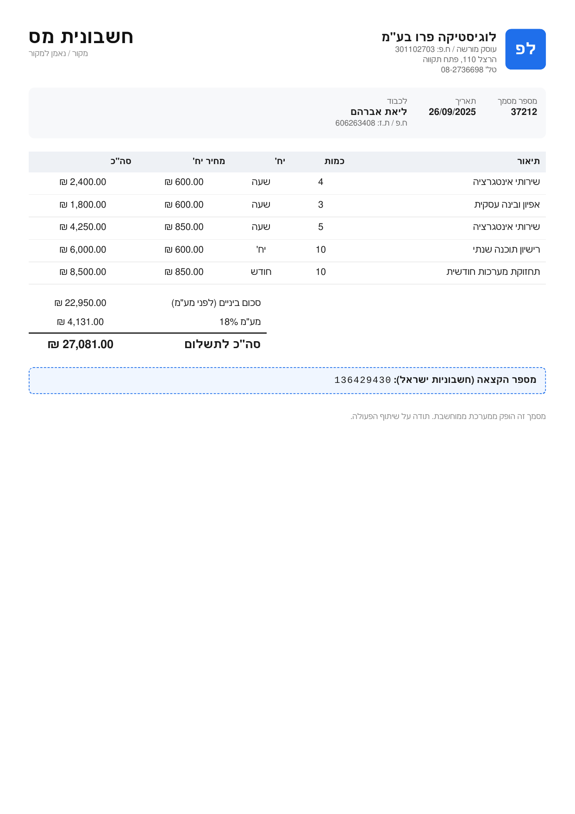

# Israeli Invoice & Document Data Extractor

**Turn a photo or PDF of an Israeli financial document into clean, structured JSON — and
automatically check how accurate the result is.** Built with a vision-LLM (Claude) so it works on
layouts it has never seen, without a hand-written rule per template.

> **בעברית:** חילוץ נתונים ממסמכים פיננסיים ישראליים (חשבוniות, קבלות, תלושי שכר, דפי בנק, שיקים)
> ל-JSON מובנה, בעזרת Vision-LLM. עובד על מסמכים בעברית (RTL) ותבניות חדשות — בלי חוקים ידניים לכל
> טופס. כולל **בדיקת דיוק אוטומטית** מול ground-truth ו**ולידציה אריתמטית** שתופסת שגיאות גם ללא
> ground-truth. שקוף לגבי פרטיות: מצב API בלי אימון על הנתונים, אופציה למודל מקומי, מיסוך PII.



*Input: the tax-invoice image above. Output: structured JSON —*

```json
{
  "doc_type": "חשבונית מס",
  "seller":   { "name": "…", "vat_id": "…" },
  "customer": { "name": "…", "id": "…" },
  "line_items": [ { "description": "…", "quantity": 3, "unit_price": 850, "line_total": 2550 } ],
  "subtotal": 22950, "vat_rate": 0.18, "vat_amount": 4131.0, "total": 27081.0,
  "allocation_number": "136429430"
}
```

*▶️ **2-min demo:** _(video link — coming soon)_*

---

## The problem · הבעיה

Israeli businesses drown in invoices, receipts and payslips — in Hebrew, right-to-left, in dozens of
layouts. Typing them into accounting software by hand is slow and error-prone. Off-the-shelf OCR
struggles with Hebrew and gives you raw text, not the *fields* you actually need (who, how much, VAT,
allocation number).

And the two things a business owner worries about with AI are: **"it makes things up"** and
**"where does my data go?"** This project answers both, directly.

## What it does · מה זה עושה

- Reads a **PNG / JPG / multi-page PDF** and returns one structured JSON record — invoices, receipts,
  payslips, bank statements and cheques all map to a single schema.
- **Checks its own work two ways:**
  1. **Accuracy vs ground-truth** — field-by-field score against the known-correct answer (for the
     bundled synthetic dataset).
  2. **Arithmetic validation** — even with *no* ground-truth (i.e. on a real client document), it
     verifies the numbers add up (line items → subtotal, subtotal + VAT → total, gross − deductions
     → net). If they don't, a field was misread. This is the honest quality signal on real documents.

## Quickstart

```bash
pip install -r requirements.txt
python app_extractor/server.py             # opens http://127.0.0.1:8002
```

**On first launch the app asks how to connect to Claude** — enter **your own API key**, use **SDK**
(uses the Claude subscription already logged in via `claude login` — **no token**), or pick **offline
demo (mock)**. Tick **Remember on this device** to save the choice locally in a **git-ignored**
`.local_credentials.json` (never committed) so later launches skip the prompt; leave it unticked and
the key is kept only for the session. A **Disconnect** button in the header clears it and re-asks on
the next launch. See [Data & privacy](#data--privacy--נתונים-ופרטיות) below.

CLI equivalents:

```bash
# single document (offline mock — shows the exact request that would be sent)
python _extractor/extract.py 01_invoice_tax/01_invoice_tax_1.png --mode mock

# whole bundled dataset → accuracy report
python _extractor/batch.py --dataset . --pred pred --mode mock
```

## Live demo

- **Web UI** at `http://127.0.0.1:8002` — extract one document (from the dataset or your own upload)
  and see a **field-by-field comparison** vs ground-truth (green/red) with an overall accuracy %; or
  run the whole dataset as a batch with a live progress stream and a "weakest fields" report.
- The UI **defaults to Hebrew** (RTL); switch to English / Russian from the header selector.
- **Interactive API showcase:** `http://127.0.0.1:8002/docs` — FastAPI auto-generates a Swagger UI
  where anyone can try the endpoints without reading code.
- **Recorded walkthrough:** _(Loom/YouTube link — coming soon)_
- A public hosted demo (mock mode, synthetic data only) can be added later.

## How it works

```
image/PDF ──► base64 pages (image BEFORE text)
          ──► Claude vision + tool-use with a fixed schema  (tool_choice forces one JSON object)
          ──► structured JSON  ──► evaluate.py (accuracy)  +  validate.py (arithmetic)
```

The extraction contract (`EXTRACTION_TOOL` schema + system prompt) is identical across three
interchangeable transports — `api`, `sdk`, `mock` — so the JSON shape never changes with the backend.
PDFs are rasterized with PyMuPDF (no poppler needed); multi-page PDFs are sent as one document.

## Reliability — no silent hallucinations

A vision model returns a wrong number just as confidently as a right one, so this project **does not
trust the output blindly:**

- **"Don't know" instead of guessing.** Fields that aren't on the document come back as `null`
  (abstention), not invented values. The schema requires only `doc_type`.
- **Arithmetic cross-checks** (`_core/validate.py`) flag any document whose totals don't reconcile —
  including a `NO_AMOUNTS` flag when a scan is too low-res to read (the classic silent-failure case).
- **Edge cases are handled, not hidden** — e.g. credit invoices carry *negative* amounts by design,
  and the validator uses signed sums so a sign error is caught.
- **Measured, not claimed.** On the bundled 24-document synthetic dataset, a sample run scored
  **~94.9%** field accuracy (see `_extractor/sample_eval_report.txt`), with a per-field breakdown
  showing exactly which fields are weakest.

> Why this matters: an airline was recently held liable for a promise its own chatbot invented
> (*Moffatt v. Air Canada*, 2024). Showing *where a value came from* and *when the system declines to
> answer* is the direct antidote to "AI makes things up." (Cited as a risk illustration, not legal advice.)

## Data & privacy · נתונים ופרטיות

Handling someone else's financial documents is handling personal data. This project is built to be
explicit about it:

- **Three AI modes**, chosen once in the first-run prompt (and clearable via **Disconnect**):
  - `mock` — fully offline, no data leaves the machine (default before you connect).
  - `api` — direct Anthropic API. You supply **your own** key in the prompt (or set `ANTHROPIC_API_KEY`
    in `.env`). The key is kept in memory for the session, and written to a git-ignored
    `.local_credentials.json` **only if you tick "Remember"** — **never committed to the repo**. For
    business/API use, **inputs are not used to train models**, and data is retained only briefly
    (Zero-Data-Retention options exist). Use this for third-party docs.
  - `sdk` — your personal Claude subscription; uses the login already on the machine (`claude login`),
    **no token entered in the app**. Fine for your own development, **not** for clients' data.
- **Local-model option (roadmap):** the transport is abstracted, so a self-hosted model (e.g. Ollama)
  can be added for on-premise, fully-local extraction.
- **PII stays out of the repo:** your key/token lives only in the git-ignored `.local_credentials.json`,
  `.env.example` carries no secrets, uploads are processed to a temp file and deleted, and the committed
  dataset is 100% synthetic. (Turn on GitHub **secret scanning + push protection** as a safety net.)
- **EU / Israel angle** — a real differentiator for local clients: Israel's Amendment No. 13 to the
  Privacy Protection Law (in force Aug 2025) and the PPA's draft AI guidance name tools like Claude
  directly and expect an internal policy on what data may be sent to them; Israel holds EU adequacy
  status; GDPR fines reach the greater of €20M / 4% of turnover. Being able to say *"your documents
  never leave your machine, or go only to a no-training API"* is a selling point, not a footnote.

## Tech stack

Python · FastAPI + Uvicorn · Claude (Anthropic API / Claude Agent SDK) · PyMuPDF · pure-stdlib
evaluation & validation.

## License

MIT — see [LICENSE](LICENSE).
